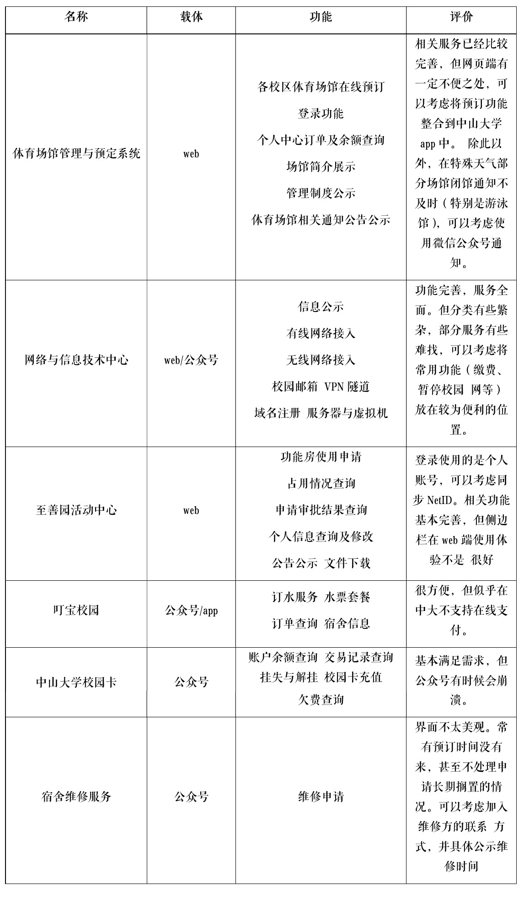
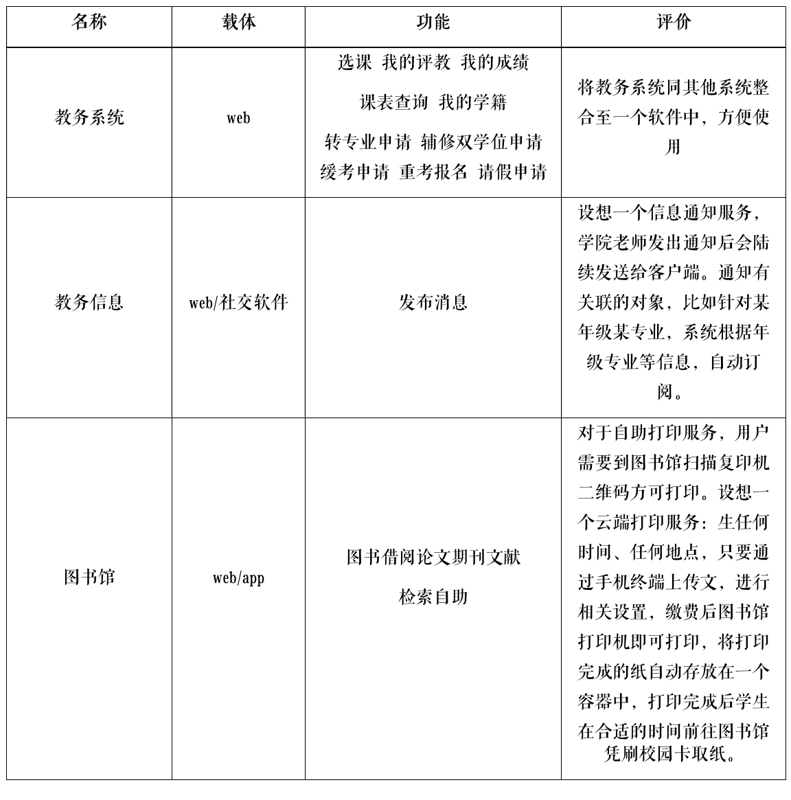
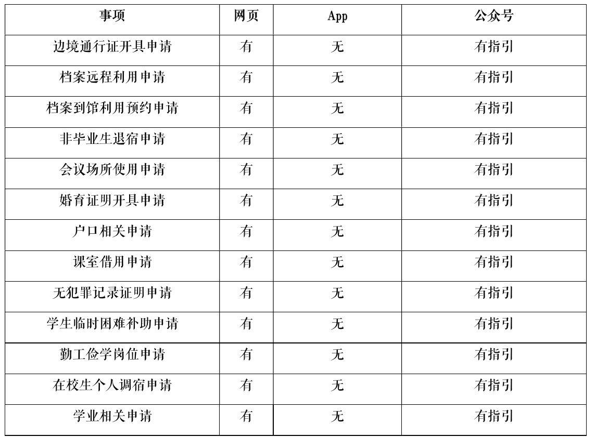
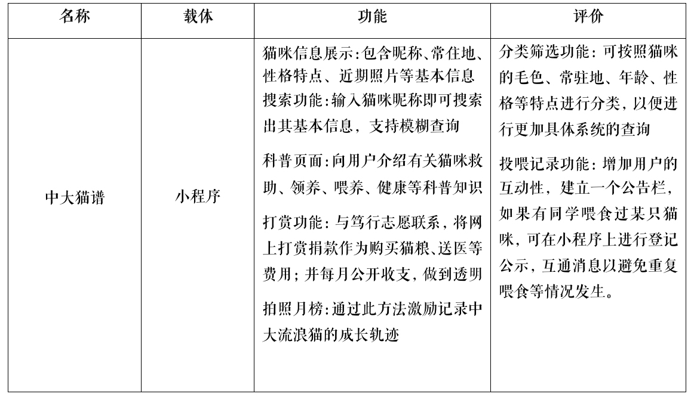
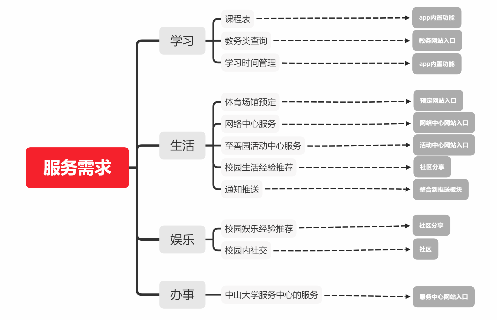
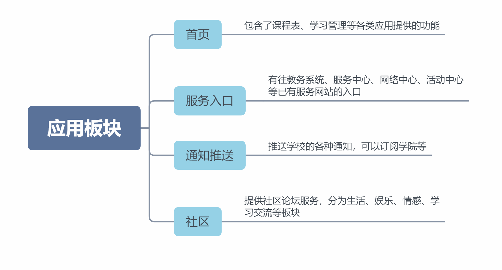
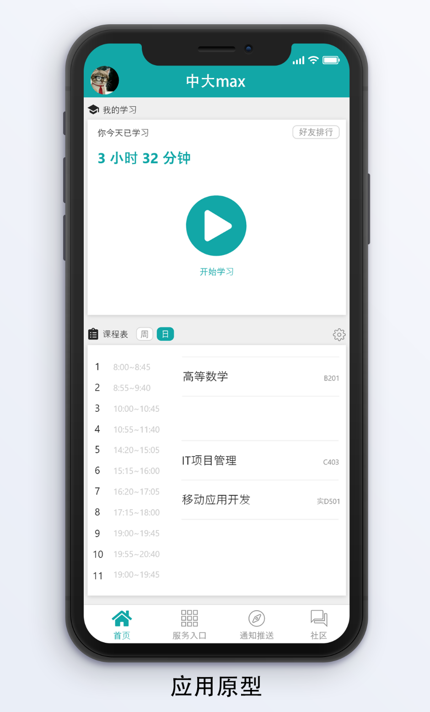

# 项目前期研究

> 中大max 组

## 中山大学现存产品、服务梳理

### 生活类

### 学习类

### 办事类

中山大学的各项办事服务都在[中山大学服务中心](http://usc.sysu.edu.cn/)办理，该网站在移动端上 并不适合浏览，不过具体的填表办理在移动端可以正常浏览。服务中心设有公众号，不过并没 有办事的接口，而是只有在网页端办事的指引。

若在移动端上也增加办事的接口，那么就可以随时随地进行各项申请，方便很多。

### 娱乐类

## 中大人IT生活攻略

痛点

- 各项服务入口杂乱  
- 通知不方便
- 部分服务没有实现完全线上
- 缺少校内交流社区

软件工程0班的班长小潘最近很忙。早上，小潘去食堂吃早饭时发现校园卡余额不足，于赶紧打开微信，搜索中山大学校园卡进行充值，但系统似乎出了问题，无法充值，小潘只能去路边买早餐了，急匆匆的跑去上课。课间，小潘想看看学校有什么最新通知，打开手机浏览器，访问http://jwb.sysu.edu.cn/以及http://jwb.sysu.edu.cn/，看到了最新的关于期末安排的通知，于是小潘将通知转发到班级群中，心想：如果学校一发通知就自动将其发送给所有学生那该多好啊。
课后，小潘想到要申请社团活动场地，需要填写并打印申请单去体育馆申请，然而这时图书馆打印正是高峰期，小潘等了15分钟才打印好一张申请单，赶紧跑去体育馆。想打印点东西好麻烦，申请场地也是。
由于下周一要出去参加比赛，小潘要请一天假。虽然可以在大学服务中心官网请假，但是这个网址找了好久才找到，而且请了假任课老师好像并不会收到通知，需要打印假条给任课老师。  
中午回到宿舍，小潘在叮宝校园上订了水，但无法在线支付，需要等水送来时支付现金，可一会儿又要去上课了，得等到什么时候呢。
晚上，小潘登录网络与信息技术中心想缴网费，但网站上服务分类有些繁杂，缴费服务有些难找。

小潘觉得目前中大人IT生活还存在诸多不便，很多服务使用手机访问不友好，并且各种公众号、网站、app比较杂乱，没有一个统一的平台管理中大IT服务，而且缺少校内娱乐社区，想要知道同学有啥推荐的好吃好玩的都难。

## program介绍

如上文所说，中山大学对学生提供的服务分散在各个官方平台，且很多在移动端都无入口，还需要自己打开不适配移动端的网站去找；也没有一个统一的获取信息平台；加上我们觉得中大没有一个可以用来分享生活、娱乐经验的面向校内社区。因此我们打算做一个移动端的应用，将服务系统入口、信息推送、社区以及其他实用服务功能整合一起。    

首先我们依旧分类将服务的需求以及实现整理出来。

然后我们将整个应用的实现分为4个板块

这就是我们提出的一个服务综合类应用

## 中大人的移动生活攻略  

大潘也是软件工程0班的学生，不过大潘的手机上有了一个综合的中大服务应用。教务信息、学校通知、场馆科室申请、校内社区、缴费、宿舍管理等统一在APP中分类管理，各项服务入口容易找到，通知精确推送至每个学生，全部实现云办事。校内社区使得学生的娱乐也更丰富。   

早上起床，大潘打开应用的推送通知，看了下今天学院又发了什么通知，又看了下今天有什么课，课室在哪里。在上了一早的课，大潘想吃一顿好的，打开应用社区力的美食专题，发现学校附近有个四川火锅很多人分享觉得好吃，于是大潘就去吃了。但是大潘是个广州人，吃不了辣，吃完马上就开始肚子不舒服。赶紧叫来了舍友送他去了医院。“但是下午还有课啊！”大潘想，于是掏出了手机，在应用的服务入口找到了请假申请的链接，请了下午的假。在病床上，大潘突然想起班长小潘昨天托付他去申请开会场地，于是又在应用入口找到了活动中心的申请链接，申请了场地。”还好有这个应用手机上就可以申请啊“，大潘感叹到。